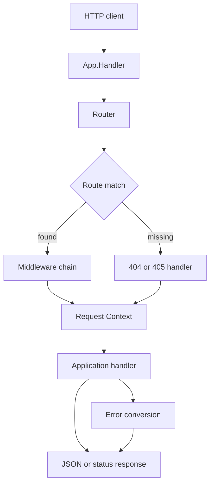

# bodhiApi

<div align="center">

**A lightweight, zero-dependency Go HTTP framework for JSON REST APIs.**

Readable source. Idiomatic `net/http`. Middleware, routing, and graceful shutdown.

[](https://go.dev/)
[](https://pkg.go.dev/github.com/anti-gravity-bit/bodhiApi)
[](./go.mod)
[](https://github.com/anti-gravity-bit/bodhiApi)
[](https://github.com/anti-gravity-bit/bodhiApi)
[](./CONTRIBUTING.md)

**golang · http-framework · rest-api · web-framework · mux · router · middleware · json-api · microservices · net/http · graceful-shutdown · slog · request-id**

</div>

> **bodhiApi** is a small, hackable HTTP toolkit for building REST backends in Go.
> If you want Gin/Echo/Chi energy with a source tree you can actually read in one sitting,
> start here.

bodhiApi is intentionally small: the request path, routing rules, middleware,
errors, and server lifecycle should be easy for a maintainer — human or AI agent —
to understand, test, and change.

## Why developers notice this repo

- **Zero third-party dependencies.** Just the Go standard library: `net/http`, `log/slog`, `encoding/json`.
- **Drop-in `net/http` compatibility.** Use `App.Handler()` with `httptest`, existing servers, or your own `http.Server`.
- **REST-ready routing.** Static paths and named parameters such as `/users/:id`. GET, POST, PUT, PATCH, DELETE helpers.
- **Middleware pipeline.** Panic recovery, `X-Request-ID` correlation, structured `slog` access logs — plus your own wrappers.
- **Safe JSON errors.** Unknown errors become generic 500s so secrets in `error.Error()` never leak to clients.
- **Graceful shutdown.** `ListenAndServe` / `Listen` + `Shutdown` for production process lifecycle.
- **Readable internals.** Linear-scan router, explicit context, no reflection magic, no codegen.
- **Agent-friendly layout.** Public facade at the module root; implementation under `internal/core`.

Looking for a **lightweight Go REST framework**, a **stdlib HTTP router**, a **Chi/Gin alternative**,
or a **JSON API starter** you can fork? You are in the right place.

## Contents

- [What it provides](#what-it-provides)
- [Quick start](#quick-start)
- [Installation](#installation)
- [Architecture](#architecture)
- [Project layout](#project-layout)
- [Routing](#routing)
- [Middleware](#middleware)
- [Context and errors](#context-and-errors)
- [How it compares](#how-it-compares)
- [Development](#development)
- [Roadmap](#roadmap)
- [Project status](#project-status)
- [Keywords](#keywords)

## What it provides

| Area | What you get |
|---|---|
| **HTTP server** | Standard-library-compatible `net/http` handler and lifecycle |
| **Router** | Static routes and named parameters (`/users/:id`) |
| **Methods** | GET, POST, PUT, PATCH, DELETE helpers |
| **Context** | Params, query strings, headers, JSON/status writers, request-scoped values |
| **Middleware** | Recover panics, request IDs, structured logs, composable `Use` |
| **Errors** | Consistent JSON HTTP errors that hide unknown internals |
| **Ops** | Timeouts, header limits, graceful shutdown |

The project is pre-alpha. The API and implementation may evolve before the first
stable release.

## Quick start

```go
package main

import (
    "net/http"

    bodhiApi "github.com/anti-gravity-bit/bodhiApi"
)

func main() {
    app := bodhiApi.New(bodhiApi.Info{
        Title:   "Users API",
        Version: "0.0.0",
    })

    app.GET("/users/:id", func(requestContext bodhiApi.Context) error {
        return requestContext.JSON(http.StatusOK, map[string]string{
            "id": requestContext.Param("id"),
        })
    })

    app.POST("/users", func(requestContext bodhiApi.Context) error {
        return requestContext.JSON(http.StatusCreated, map[string]string{
            "status": "created",
        })
    })

    if listenError := app.ListenAndServe(":8080"); listenError != nil {
        panic(listenError)
    }
}
```

The built-in `GET /health` route returns:

```json
{"status":"ok"}
```

## Installation

```bash
go get github.com/anti-gravity-bit/bodhiApi
```

Import it as:

```go
import bodhiApi "github.com/anti-gravity-bit/bodhiApi"
```

Requires **Go 1.26.1** or newer.

## Architecture

The public package remains at the module root so existing users can keep importing
`github.com/anti-gravity-bit/bodhiApi`. Implementation responsibilities are
separated below it rather than placing every concern in one root file.



### Request lifecycle

1. `App.Handler` receives a standard `net/http` request.
2. The router matches method and path segments.
3. Middleware wraps the selected handler.
4. A request-scoped `Context` is created.
5. The handler reads input or writes a response.
6. Returned errors become safe JSON HTTP errors when no response was written.

## Project layout

```text
bodhiApi/
├── api.go                         # stable public facade and type aliases
├── api_test.go                    # public API and integration tests
├── example_test.go                # godoc examples
├── internal/
│   └── core/
│       ├── contracts.go            # shared Handler, Middleware, Context contracts
│       ├── app/
│       │   └── app.go              # application lifecycle and request dispatch
│       ├── context/
│       │   ├── context.go          # request state and response helpers
│       │   └── context_test.go     # context behavior tests
│       ├── errors/
│       │   ├── errors.go           # safe HTTP error model and conversion
│       │   └── errors_test.go      # error contract tests
│       ├── middleware/
│       │   ├── middleware.go       # recovery, request IDs, structured logs
│       │   └── middleware_test.go  # middleware behavior tests
│       └── router/
│           ├── router.go           # route registration and matching
│           └── router_test.go      # precedence and validation tests
├── go.mod                         # module metadata — stdlib only
├── README.md                      # usage and architecture guide
└── CONTRIBUTING.md                # human and AI-agent maintenance guide
```

### Package boundaries

| Area | Responsibility | Should depend on |
|---|---|---|
| Public root | Stable exported API | Internal implementation |
| `internal/core` | Shared contracts | Standard library types |
| `internal/core/app` | Lifecycle and request dispatch | Router, context, middleware, errors |
| `internal/core/router` | Registration and matching | Core contracts, context, errors |
| `internal/core/context` | Request/response state | `net/http` |
| `internal/core/middleware` | Recovery, request IDs, logging | Core contracts and errors |
| `internal/core/errors` | Safe HTTP error model | Standard errors and HTTP |

The `internal` packages are not importable by applications outside this module.
That keeps implementation details replaceable while the root package remains the
compatibility boundary.

## Routing

```go
app.GET("/users", listUsers)
app.GET("/users/:id", getUser)
app.POST("/users", createUser)
```

Current behavior:

- Paths must begin with `/`.
- Routes match HTTP method and path segments.
- A segment beginning with `:` is a named parameter.
- Parameters are available with `requestContext.Param("name")`.
- Static routes take precedence over parameter routes.
- The first matching parameter route is used as fallback.
- Trailing slashes are significant.
- A matching path with another method returns 405 details.
- An unknown path returns a 404 error.

The current router intentionally uses a readable linear scan. A future optimized
trie/radix router must preserve these semantics.

## Middleware

Middleware has the form:

```go
type Middleware func(Handler) Handler
```

Example:

```go
app.Use(func(nextHandler bodhiApi.Handler) bodhiApi.Handler {
    return func(requestContext bodhiApi.Context) error {
        // before
        handlerError := nextHandler(requestContext)
        // after
        return handlerError
    }
})
```

The default stack is:


- `Recover` converts panics into internal server errors.
- `RequestID` reuses or generates `X-Request-ID`.
- `Logger` emits structured `log/slog` request logs.

## Context and errors

`Context` provides:

- `Request()` and `ResponseWriter()`
- `Param`, `Query`, and `Header`
- `JSON` and `Status` response helpers
- Request-scoped `Set` and `Get` storage

Return an explicit HTTP error when a request is invalid:

```go
return bodhiApi.NewHTTPError(
    http.StatusBadRequest,
    "email is required",
)
```

Common helpers include:

```go
return bodhiApi.NotFound("user not found")
return bodhiApi.MethodNotAllowed("GET, POST")
```

Unknown errors are converted to a generic internal error so implementation details
are not exposed to API clients.

## How it compares

bodhiApi is not trying to replace every feature of Gin, Echo, Chi, or Fiber.
It is a **small JSON REST foundation** for people who want to read the source,
teach HTTP servers, or grow a backend without a large dependency graph.

| | bodhiApi | Typical batteries-included framework |
|---|---|---|
| Dependencies | Standard library only | Often several third-party modules |
| Router | Linear scan, explicit rules | Trie/radix, sometimes more magic |
| API surface | Small, documented facade | Large helper catalog |
| Best fit | Readable REST APIs, learning, forking | Huge apps that want every plugin |

If you outgrow it, `App.Handler()` is still a plain `http.Handler`.

## Development

The repository requires Go 1.26.1 or newer.

```bash
# Format source files
gofmt -w .

# Run all tests
go test ./...

# Run tests with the race detector
go test -race ./...

# Inspect packages
go list ./...
```

Keep changes focused and preserve the public root package unless an intentional
API change is documented. Add tests alongside the package or behavior they cover.

See [CONTRIBUTING.md](./CONTRIBUTING.md) for design rules and agent guidance.

## Roadmap

### Routing

- Deterministic trie/radix lookup
- Duplicate and ambiguous route validation
- Route groups and group-level middleware
- Full HTTP method support and correct `Allow` headers

### Safety and API ergonomics

- Request body limits and configurable timeouts
- Double-write protection
- Typed binding and validation
- Consistent pagination and content negotiation helpers

### Production operations

- Metrics and OpenTelemetry hooks
- Secure headers, CORS, and rate limiting
- Readiness and startup probes
- Deployment and graceful-drain guidance
- OpenAPI generation and compatibility tooling

## Project status

This is the 0th release / pre-alpha. The project is a working foundation, not a
promise of a stable framework contract. Feedback, tests, and real usage should
shape future changes.

The name **bodhiApi** is inspired by *bodhi*, a concept associated with clarity
and understanding. In engineering terms, that means making complexity visible,
choosing simple designs that can be reasoned about, and improving reliability
continuously.

If this matches how you like to build Go services, star the repo, open an issue,
or send a focused pull request.

## Keywords

`golang` `go` `http` `http-framework` `web-framework` `rest` `rest-api` `json-api`
`router` `mux` `middleware` `net-http` `api-server` `microservices` `backend`
`zero-dependency` `stdlib` `graceful-shutdown` `request-id` `slog` `panic-recovery`
`chi-alternative` `gin-alternative` `echo-alternative` `lightweight` `hackable`
`developer-tools` `open-source`
